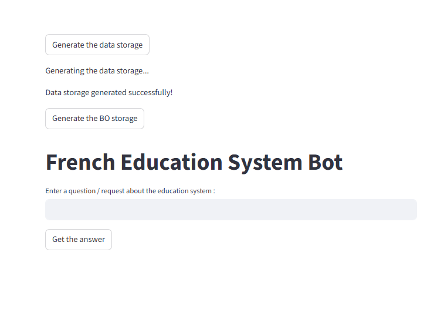
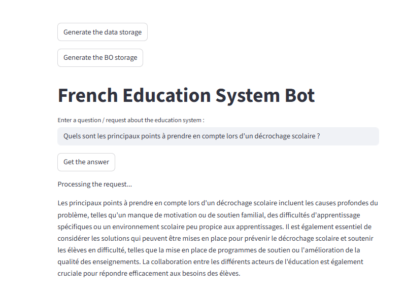

Author : Arnaud TECHER

The French Education Bot aims to create a RAG system that use multiple documentation from the french school system to help the administration retrive specific knowledge on the school system. This project is in python and include the complete creation of an AI Agent. The main librairy used is Llama_index with LLM model such as Ollama and HuggingFace model. The AI Agent built in the code can be feed with official documentation from french government directly scrap on the internet.

The main concept apply in this project are : 
    - Web Scraping in Python using Selenium and Beautiful Soup
    - Manipulate Embeddings using Llama-index and a Hugging Face LLM
    - Create a RAG system using Llama-index librairy
    - Creation of a AI Agent that use retrieve data from web scraping and .pdf file in order to answer to user's questions.
    - Create a simple Web interface using Streamlit

This project use a local LLM model in order to answer user's questions.
The simple interface is based on Streamlit and allowed the user to create the embedded database using the .pdf file and Scrape last education information from the governement website in order to complete the database. 

  

The AI Model display the answer to the user as a conversation with a bot.
Hereafter, you will find an exemple of question with the AI Agent answer based on the associate .PDF file. 

  

